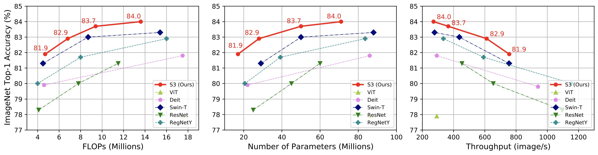

# Searching the Search Space of Vision Transformer

**This is an official implementation of S3.**

In this work, instead of searching the architecture in a predefined search space, with the help of AutoFormer, we proposed to search the search space to automatically find a great search space first. After that we search the architectures in the searched space.
In addition, we provide insightful observations and guidelines for general vision transformer design.

<div align="center">
    
</div>


## Environment Setup

To set up the enviroment you can easily run the following command:
```buildoutcfg
conda create -n SSS python=3.6
conda activate SSS
pip install -r requirements.txt
```

## Data Preparation 
You need to first download the [ImageNet-2012](http://www.image-net.org/) to the folder `./data/imagenet` and move the validation set to the subfolder `./data/imagenet/val`. To move the validation set, you cloud use the following script: <https://raw.githubusercontent.com/soumith/imagenetloader.torch/master/valprep.sh>

The directory structure is the standard layout as following.
```
/path/to/imagenet/
  train/
    class1/
      img1.jpeg
    class2/
      img2.jpeg
  val/
    class1/
      img3.jpeg
    class/2
      img4.jpeg
```


## Model Zoo
For evaluation, we provide the checkpoints and configs of our models in [GitHub](https://github.com/silent-chen/AutoFormerV2-model-zoo/).

After downloading the models, you can do the evaluation following the description in *Evaluation*).

Model download links:

Model | Params. | Top-1 Acc. % | Top-5 Acc. % | Download link 
--- |:---:|:---:|:---:|:---:
AutoFormerV2-T | 28M | 82.1 | 95.8 | [GitHub](https://github.com/silent-chen/AutoFormerV2-model-zoo/releases/download/v1.0.0/S3-T.pth)
AutoFormerV2-S | 50M | 83.7 | 96.4 | [GitHub](https://github.com/silent-chen/AutoFormerV2-model-zoo/releases/download/v1.0.0/S3-S.pth)
AutoFormerV2-B | 71M | 84.0 | 96.6 | [GitHub](https://github.com/silent-chen/AutoFormerV2-model-zoo/releases/download/v1.0.0/S3-B.pth)

### Evaluation
To evaluate our trained models, you need to put the downloaded model in `/PATH/TO/CHECKPOINT`. After that you could use the following command to test the model (Please change your config file and model checkpoint according to different models. Here we use the AutoFormer-B as an example).
```buildoutcfg
python -m torch.distributed.launch --nproc_per_node=8 --use_env evaluation.py --data-path /PATH/TO/IMAGENT \
--dist-eval --cfg ./config/S3-B.yaml --resume /PATH/TO/CHECKPOINT --eval 
```

## Performance

We give the performance comparison between S3 and other state-of-the-art methods under different resources constraint in terms of Top-1 accuracy on ImageNet. Our method achieves very competitive performance, being superior to the recent DeiT, ViT, Swin.
<div align="center">
    
</div>

## Bibtex

If this repo is helpful for you, please consider to cite it. Thank you! :)
```bibtex
@article{S3,
  title={Searching the Search Space of Vision Transformer},
  author={Minghao, Chen and Kan, Wu and Bolin, Ni and Houwen, Peng and Bei, Liu and Jianlong, Fu and Hongyang, Chao and Haibin, Ling},
  booktitle={Conference and Workshop on Neural Information Processing Systems (NeurIPS)},
  year={2021}
}
```

## Acknowledgements

The codes are inspired by [HAT](https://github.com/mit-han-lab/hardware-aware-transformers), [timm](https://github.com/rwightman/pytorch-image-models), [DeiT](https://github.com/facebookresearch/deit), [SPOS](https://github.com/megvii-model/SinglePathOneShot), [AutoFormer](https://github.com/microsoft/Cream/tree/main/AutoFormer), [Swin](https://github.com/microsoft/Swin-Transformer) .
