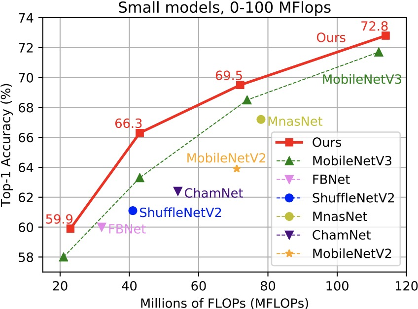

Hiring research interns for neural architecture search projects: houwen.peng@microsoft.com

# Cream of the Crop: Distilling Prioritized Paths For One-Shot Neural Architecture Search 
This is an official implementation for our Cream NAS work presented in NeurIPS'20.

**[[Paper]](https://papers.nips.cc/paper/2020/file/d072677d210ac4c03ba046120f0802ec-Paper.pdf) [[Models-Google Drive]](https://drive.google.com/drive/folders/1NLGAbBF9bA1IUAxKlk2VjgRXhr6RHvRW?usp=sharing)[[Models-Baidu Disk (password: wqw6)]](https://pan.baidu.com/s/1TqQNm2s14oEdyNPimw3T9g) [[Slides]]() [[BibTex]](https://scholar.googleusercontent.com/scholar.bib?q=info:ICWVXc_SsKAJ:scholar.google.com/&output=citation&scisdr=CgUmooXfEMfTi0cV5aU:AAGBfm0AAAAAX7sQ_aXoamdKRaBI12tAVN8REq1VKNwM&scisig=AAGBfm0AAAAAX7sQ_RdYtp6BSro3zgbXVJU2MCgsG730&scisf=4&ct=citation&cd=-1&hl=ja)**  <br/>

In this work, we present a simple yet effective architecture distillation method. The central idea is that subnetworks can learn collaboratively and teach each other throughout the training process, aiming to boost the convergence of individual models. We introduce the concept of prioritized path, which refers to the architecture candidates exhibiting superior performance during training. Distilling knowledge from the prioritized paths is able to boost the training of subnetworks. Since the prioritized paths are changed on the fly depending on their performance and complexity, the final obtained paths are the cream of the crop.
<div >
    
</div>

## Environment Setup

To set up the enviroment you can easily run the following command:
```buildoutcfg
git clone https://github.com/mapleam/Cream.git
cd Cream
conda create -n Cream python=3.6
conda activate Cream
pip install -r requirements

# (required) install apex to accelerate the training, a little bit faster than pytorch DistributedDataParallel
cd lib
git clone https://github.com/NVIDIA/apex.git
python ./apex/setup.py install --cpp_ext --cuda_ext
```

## Data Preparation 
You need to first download the [ImageNet-2012](http://www.image-net.org/) to the folder `./data/imagenet` and move the validation set to the subfolder `./data/imagenet/val`. To move the validation set, you cloud use the following script: <https://raw.githubusercontent.com/soumith/imagenetloader.torch/master/valprep.sh> *[todo]*

Put the imagenet data in ./data. It should look like:
```buildoutcfg
./data/imagenet/train
./data/imagenet/val
...
```

## Checkpoints For Test
For quick test, we have stored the checkpoints of our models in [Google Drive](https://drive.google.com/drive/folders/1NLGAbBF9bA1IUAxKlk2VjgRXhr6RHvRW?usp=sharing) (or [Baidu Disk (password: wqw6)](https://pan.baidu.com/s/1TqQNm2s14oEdyNPimw3T9g)).

Just download the checkpoints from [Google Drive](https://drive.google.com/drive/folders/1NLGAbBF9bA1IUAxKlk2VjgRXhr6RHvRW?usp=sharing) (or [Baidu Disk](https://pan.baidu.com/s/1TqQNm2s14oEdyNPimw3T9g)) and put the checkpoints in `./experiments/workspace/ckps/`.

Then you can do the test right now (as described in the following *Quick Start, III. Test*).

Model download links:
Model | FLOPs | Top-1 Acc. % | Top-5 Acc. % | Link 
--- |:---:|:---:|:---:|:---:
Cream_14 | 14M | 53.8 | 77.2 | [Google](https://drive.google.com/file/d/19knbGCUlU9DYJp9En8mzQ3o390Q0gJeB/view?usp=sharing) / [Baidu (password: wqw6)](https://pan.baidu.com/s/1TqQNm2s14oEdyNPimw3T9g) 
Cream_43 | 43M | 66.3 | 86.7 | [Google](https://drive.google.com/file/d/1ILTXIuIqkN_WMfBd3lc6r-dNeADULYna/view?usp=sharing) / [Baidu (password: wqw6)](https://pan.baidu.com/s/1TqQNm2s14oEdyNPimw3T9g)
Cream_114 | 114M | 72.8 | 90.8 | [Google](https://drive.google.com/file/d/1DPoCEF0CufRsGyY5_iyCmeb0gT21knQG/view?usp=sharing) / [Baidu (password: wqw6)](https://pan.baidu.com/s/1TqQNm2s14oEdyNPimw3T9g)
Cream_287 | 287M | 77.6 | 93.3 | [Google](https://drive.google.com/file/d/1F3cbpmr91vwzlcoGZauqieRm5Ca0glZ_/view?usp=sharing) / [Baidu (password: wqw6)](https://pan.baidu.com/s/1TqQNm2s14oEdyNPimw3T9g)
Cream_481 | 481M | 79.2 | 94.2 | [Google](https://drive.google.com/file/d/1RzJBr7wc1XolNtw8TvMDRPeFzyRypuS9/view?usp=sharing) / [Baidu (password: wqw6)](https://pan.baidu.com/s/1TqQNm2s14oEdyNPimw3T9g)
Cream_604 | 604M | 80.0 | 94.7 | [Google](https://drive.google.com/file/d/18ZUkgxIGqQ0DaW1oTAVsL0JT1l0YAX1K/view?usp=sharing) / [Baidu (password: wqw6)](https://pan.baidu.com/s/1TqQNm2s14oEdyNPimw3T9g)


## Quick Start
We provide *search*, *retrain* and *test* code of our Cream NAS algorithm as follows.

### I. Search
To search for an architecture, you need to configure the parameters `FLOPS_MINIMUM` and `FLOPS_MAXIMUM` to specify the desired model Flops, for example, pick up a value from 0 to 600 MB Flops. You can specify the Flops interval [`FLOPS_MINIMUM`, `FLOPS_MAXIMUM`] in the YAML configure file: `./experiments/configs/train/train.yaml`.
```buildoutcfg
Line 51：FLOPS_MINIMUM: 0 # Minimum Flops of Architecture
Line 52：FLOPS_MAXIMUM: 600 # Maximum Flops of Architecture
```

After you specify the Flops of the architectures, you can search an architecture now by running:
```buildoutcfg
python ./tools/main.py train ./experiments/configs/train/train.yaml
```

### II. Retrain 
We also give the architecture we searched. To train those architectures, you need to configure the parameter `MODEL_SELECTION` to specify the model Flops. To specify which model to train, you should add `MODEL_SELECTION` in `./experiments/configs/retrain/retrain.yaml`. You can select one from [14,43,114,287,481,604], which stands for different Flops(MB).
```buildoutcfg
MODEL_SELECTION: 43 # Retrain 43m model
MODEL_SELECTION: 481 # Retrain 481m model
......
```

After specifying the Flops, you need to choose the config settings in `./experiments/configs/retrain/retrain.yaml`. The config files are in `./expperiments/configs/retrain`
```buildoutcfg
./experiments/configs/retrain/43.yaml
./experiments/configs/retrain/481.yaml
......
```

After adding `MODEL_SELECTION` in `retrain.yaml`, you need to use the following command to train the model.
```buildoutcfg
python ./tools/main.py retrain ./experiments/configs/retrain/retrain.yaml
```

The trained model and log file will be saved in `./experiments/workspace/retrain`. You can configure the `SAVE_PATH` in `./experiments/configs/retrain/retrain.yaml` to specify a path for saving the model and log file.

### III. Test
To test our trained of models, you need to use `MODEL_SELECTION` in `./experiments/configs/test/test.yaml` to specify which model to test.
```buildoutcfg
MODEL_SELECTION: 43 # test 43m model
MODEL_SELECTION: 481 # test 481m model
......
```

After specifying the Flops of the model, you need to write the path to the resume model in `./experiments/configs/test/test.yaml`.
```buildoutcfg
RESUME_PATH: './experiments/workspace/ckps/43.pth.tar'
RESUME_PATH: './experiments/workspace/ckps/481.pth.tar'
......
```

After adding `MODEL_SELECTION` and `RESUME_PATH` in `./experiments/configs/test/test.yaml`, you need to use the following command to test the model.
```buildoutcfg
python ./tools/main.py test ./experiments/configs/test/test.yaml
```

The test result will be saved in `./experiments/workspace/test`. You can configure the `SAVE_PATH` in `./experiments/configs/test/test.yaml` to specify a path for it.

##### Test Rank Correlation 

To perform a correlation analysis, we randomly sample 30 subnetworks from the hypernetwork and calculate the rank correlation between the weight sharing performance and the true performance of training from scratch. Unfortunately, training these subnetworks on ImageNet is very computational expensive, we thus construct a subImageNet dataset, which only consists of 100 classes randomly sampled from ImageNet. Each class has 250 training images and 50 validation images. We can generate the imagelist by running the following script: 

```buildoutcfg
python ./tools/generate_subImageNet.py
```
Thus we get the subImageNet in `./data/subImagnet`. The class list is provided in `./data/subclass_list.txt`. The images list is provided in `./data/subimages_list.txt`


## Performance
The top-1 accuracy on ImageNet. Our method achieves very competitive performance, being superior to the recent MobileNetV3 and EfficientNet-B0/B1.

<div align="half">
    
    
</div>

## BibTex
```bibtex
@article{Cream,
  title={Cream of the Crop: Distilling Prioritized Paths For One-Shot Neural Architecture Search},
  author={Peng, Houwen and Du, Hao and Yu, Hongyuan and Li, Qi and Liao, Jing and Fu, Jianlong},
  journal={Advances in Neural Information Processing Systems},
  volume={33},
  year={2020}
}
```

## License
License under an MIT license.

