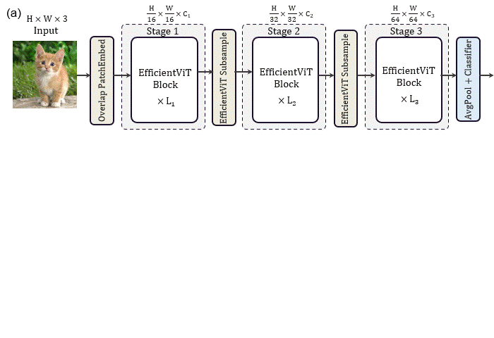
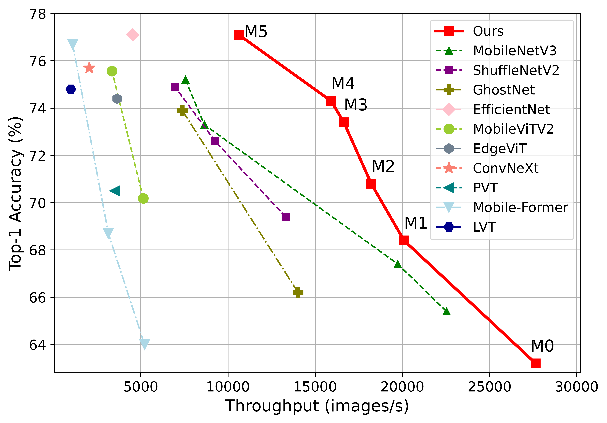

# EfficientViT: Memory Efficient Vision Transformer with Cascaded Group Attention

:pushpin: This is an official PyTorch implementation of **[CVPR 2023]** - EfficientViT: Memory Efficient Vision Transformer with Cascaded Group Attention

> [**EfficientViT: Memory Efficient Vision Transformer with Cascaded Group Attention**]()<br>
> [Xinyu Liu](https://xinyuliu-jeffrey.github.io/), [Houwen Peng](https://houwenpeng.com/), [Ningxin Zheng](https://www.microsoft.com/en-us/research/people/nizhen/), [Yuqing Yang](https://www.microsoft.com/en-us/research/people/yuqyang/), [Han Hu](https://ancientmooner.github.io/), [Yixuan Yuan](http://www.ee.cuhk.edu.hk/~yxyuan/)<br>The Chinese Univerisity of Hong Kong, Microsoft Research Asia

**EfficientViT** is a family of high-speed vision transformers. It is built with a new memory efficient building block with a **sandwich layout**, and an efficient **cascaded group attention** operation which mitigates attention computation redundancy. 

<div align="center">
    
</div>


## News

**[2023.5.11]** :newspaper: Code and pre-trained models of EfficientViT are released.


## Highlights

<div align="center">
    <br>
    Models are trained on ImageNet-1K and measured with V100 GPU.
</div>
<br>
:star: EfficientViT family shows better speed and accuracy.

* EfficientViT uses **sandwich layout** block to reduce memory time consumption and **cascaded group attention** to mitigate attention computation redundancy.

* EfficientViT-M0 with **63.2%** Top-1 accuracy achieves **27,644 images/s** on V100 GPU, **228.4 images/s** on Intel CPU, and **340.1 images/s** as onnx models.

* EfficientViT-M4 achieves **74.3%** Top-1 accuracy on ImageNet-1k, with **15,914 imgs/s** inference throughput under 224x224 resolutions, measured on the V100 GPU.

* EfficientViT-M5 trained for 300 epochs (~**30h** on 8 V100 GPUs) achieves **77.1%** Top-1 accuracy and **93.4%** Top-5 accuracy with a throughput of **10,621 images/s** on V100 GPU.


## Get Started

:beginner: We provide a simple way to use the pre-trained EfficientViT models directly:

```python
from classification.model.build import EfficientViT_M4
model = EfficientViT_M4(pretrained='efficientvit_m4')
out = model(image)
```

:hammer: Here we provide setup, evaluation, and training scripts for different tasks.

### Image Classification

Please refer to [Classification](./classification/README.md).

### Object Detection and Instance Segmentation

Please refer to [Downstream](./downstream/README.md).

## Citation

If you find our project is helpful, please feel free to leave a star and cite our paper:
```BibTeX
@InProceedings{liu2023efficientvit,
    title     = {EfficientViT: Memory Efficient Vision Transformer with Cascaded Group Attention},
    author    = {Liu, Xinyu and Peng, Houwen and Zheng, Ningxin and Yang, Yuqing and Hu, Han and Yuan, Yixuan},
    booktitle = {Proceedings of the IEEE/CVF Conference on Computer Vision and Pattern Recognition (CVPR)},
    year      = {2023},
}
```

## Acknowledge

We sincerely appreciate [Swin Transformer](https://github.com/microsoft/swin-transformer), [LeViT](https://github.com/facebookresearch/LeViT), [pytorch-image-models](https://github.com/rwightman/pytorch-image-models), and [PyTorch](https://github.com/pytorch/pytorch) for their awesome codebases.

## License

- [License](./LICENSE)
