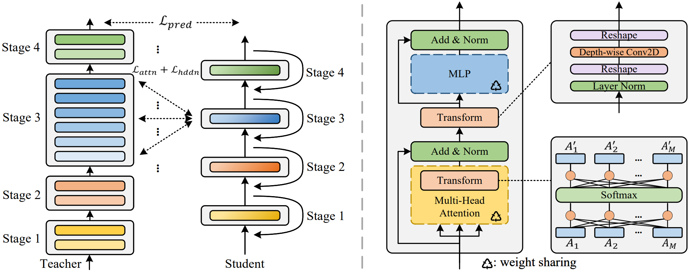
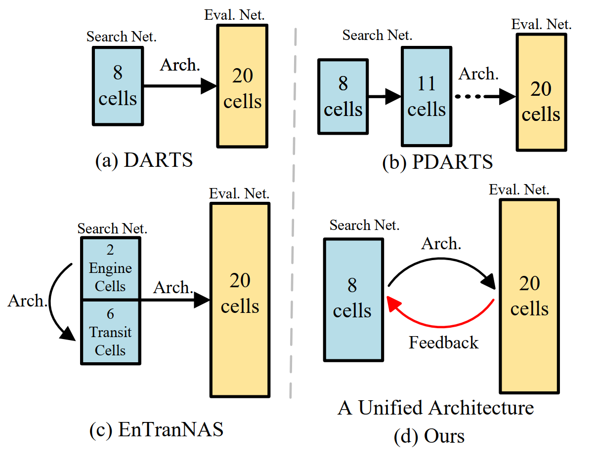
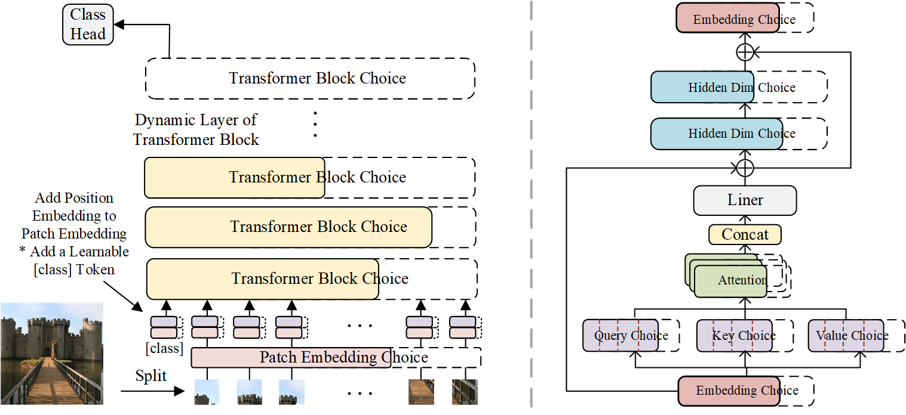
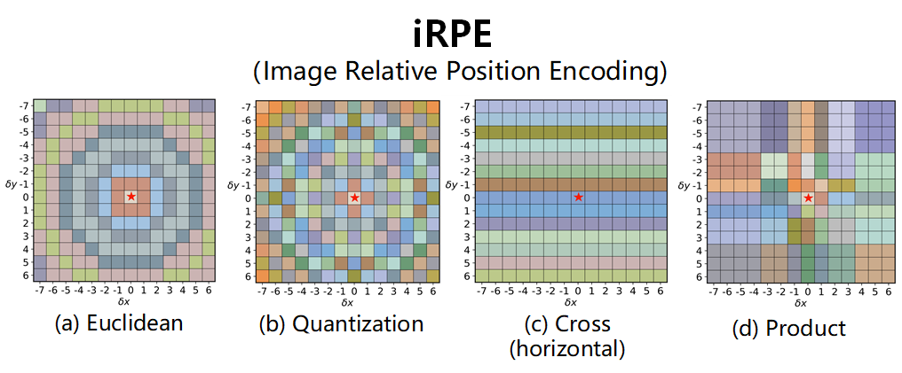

# Neureal Architecture Design and Search

***This is a collection of our AutoML-NAS work***

> [**MiniViT**](./MiniViT) (```@CVPR'22```): **MiniViT: Compressing Vision Transformers with Weight Multiplexing**

> [**CDARTS**](./CDARTS) (```@TPAMI'22```): **Cyclic Differentiable Architecture Search**


> [**AutoFormerV2**](./AutoFormerV2) (```@NeurIPS'21```): **Searching the Search Space of Vision Transformer**


> [**iRPE**](./iRPE) (```@ICCV'21```): **Rethinking and Improving Relative Position Encoding for Vision Transformer**


> [**AutoFormer**](./AutoFormer) (```@ICCV'21```): **AutoFormer: Searching Transformers for Visual Recognition**


> [**Cream**](./Cream) (```@NeurIPS'20```): **Cream of the Crop: Distilling Prioritized Paths For One-Shot Neural Architecture Search**

We also implemented our NAS algorithms on Microsoft [**NNI**](https://github.com/microsoft/nni) (Neural Network Intelligence).

## News
- :sunny: Hiring research interns for neural architecture search, tiny transformer design, model compression projects: houwen.peng@microsoft.com
- :boom: Apr, 2022: Code for [**MiniViT**](./MiniViT) is now released.
- :boom: Mar, 2022: [**MiniViT**](https://arxiv.org/pdf/2204.07154.pdf) has been accepted by CVPR'22.
- :boom: Feb, 2022: Code for [**CDARTS**](./CDARTS) is now released.
- :boom: Feb, 2022: [**CDARTS**](./CDARTS) has been accepted by TPAMI'22.
- :boom: Jan, 2022: Code for [**AutoFormerV2**](./AutoFormerV2) is now released.
- :boom: Oct, 2021: [**AutoFormerV2**](./AutoFormerV2) has been accepted by NeurIPS'21, code will be released soon.
- :boom: Aug, 2021: Code for [**AutoFormer**](./AutoFormer) is now released.
- :boom: July, 2021: [**iRPE code**](./iRPE) (**with CUDA Acceleration**) is now released. Paper is [here](https://openaccess.thecvf.com/content/ICCV2021/html/Wu_Rethinking_and_Improving_Relative_Position_Encoding_for_Vision_Transformer_ICCV_2021_paper.html).
- :boom: July, 2021: [**iRPE**](https://openaccess.thecvf.com/content/ICCV2021/html/Wu_Rethinking_and_Improving_Relative_Position_Encoding_for_Vision_Transformer_ICCV_2021_paper.html) has been accepted by ICCV'21.
- :boom: July, 2021: [**AutoFormer**](https://arxiv.org/abs/2107.00651) has been accepted by ICCV'21.
- :boom: July, 2021: [**AutoFormer**](./AutoFormer) is now available on [arXiv](https://arxiv.org/abs/2107.00651).
- :boom: Oct, 2020: Code for [**Cream**](./Cream) is now released.
- :boom: Oct, 2020: [**Cream**](./Cream) was accepted to NeurIPS'20

## Works
### [MiniViT](./MiniViT)
MiniViT is a new compression framework that achieves parameter reduction in vision transformers while retaining the same performance. The central idea of MiniViT is to multiplex the weights of consecutive transformer blocks. Specifically, we make the weights shared across layers, while imposing a transformation on the weights to increase diversity. Weight distillation over self-attention is also applied to transfer knowledge from large-scale ViT models to weight-multiplexed compact models.
<div align="center">
    
</div>

### [CDARTS](./CDARTS)
In this work, we propose new joint optimization objectives and a novel Cyclic Differentiable ARchiTecture Search framework, dubbed CDARTS. Considering the structure difference, CDARTS builds a cyclic feedback mechanism between the search and evaluation networks with introspective distillation. 
<div align="center">
    
</div>


### [AutoFormerV2](./AutoFormerV2)
In this work, instead of searching the architecture in a predefined search space, with the help of AutoFormer, we proposed to search the search space to automatically find a great search space first. 
After that we search the architectures in the searched space. In addition, we provide insightful observations and guidelines for general vision transformer design.
<div align="center">
    
</div>


### [AutoFormer](./AutoFormer)

AutoFormer is new one-shot architecture search framework dedicated to vision transformer search. It entangles the weights of different vision transformer blocks in the same layers during supernet training. 
Benefiting from the strategy, the trained supernet allows thousands of subnets to be very well-trained. Specifically, the performance of these subnets with weights inherited from the supernet is comparable to those retrained from scratch.
<div align="center">
    
</div>

### [iRPE](./iRPE)
**Image RPE (iRPE for short) methods are new relative position encoding methods dedicated to 2D images**, considering directional relative distance modeling as well as the interactions between queries and relative position embeddings in self-attention mechanism. The proposed iRPE methods are simple and lightweight, being easily plugged into transformer blocks. Experiments demonstrate that solely due to the proposed encoding methods, **DeiT and DETR obtain up to 1.5% (top-1 Acc) and 1.3% (mAP) stable improvements** over their original versions on ImageNet and COCO respectively, without tuning any extra hyperparamters such as learning rate and weight decay. Our ablation and analysis also yield interesting findings, some of which run counter to previous understanding.
<div align="center">
    
</div>


### [Cream](./Cream)
**[[Paper]](https://papers.nips.cc/paper/2020/file/d072677d210ac4c03ba046120f0802ec-Paper.pdf) [[Models-Google Drive]](https://drive.google.com/drive/folders/1NLGAbBF9bA1IUAxKlk2VjgRXhr6RHvRW?usp=sharing)[[Models-Baidu Disk (password: wqw6)]](https://pan.baidu.com/s/1TqQNm2s14oEdyNPimw3T9g) [[Slides]]() [[BibTex]](https://scholar.googleusercontent.com/scholar.bib?q=info:ICWVXc_SsKAJ:scholar.google.com/&output=citation&scisdr=CgUmooXfEMfTi0cV5aU:AAGBfm0AAAAAX7sQ_aXoamdKRaBI12tAVN8REq1VKNwM&scisig=AAGBfm0AAAAAX7sQ_RdYtp6BSro3zgbXVJU2MCgsG730&scisf=4&ct=citation&cd=-1&hl=ja)**  <br/>

In this work, we present a simple yet effective architecture distillation method. The central idea is that subnetworks can learn collaboratively and teach each other throughout the training process, aiming to boost the convergence of individual models. We introduce the concept of prioritized path, which refers to the architecture candidates exhibiting superior performance during training. Distilling knowledge from the prioritized paths is able to boost the training of subnetworks. Since the prioritized paths are changed on the fly depending on their performance and complexity, the final obtained paths are the cream of the crop.
<div >
    
</div>


## Bibtex
```bibtex
@article{MiniViT,
  title={MiniViT: Compressing Vision Transformers with Weight Multiplexing},
  author={Zhang, Jinnian and Peng, Houwen and Wu, Kan and Liu, Mengchen and Xiao, Bin and Fu, Jianlong and Yuan, Lu},
  booktitle={Proceedings of the IEEE/CVF Conference on Computer Vision and Pattern Recognition (CVPR)},
  year={2022}
}

@article{CDARTS,
  title={Cyclic Differentiable Architecture Search},
  author={Yu, Hongyuan and Peng, Houwen and Huang, Yan and Fu, Jianlong and Du, Hao and Wang, Liang and Ling, Haibin},
  journal={IEEE Transactions on Pattern Analysis and Machine Intelligence (TPAMI)},
  year={2022}
}

@article{S3,
  title={Searching the Search Space of Vision Transformer},
  author={Minghao, Chen and Kan, Wu and Bolin, Ni and Houwen, Peng and Bei, Liu and Jianlong, Fu and Hongyang, Chao and Haibin, Ling},
  booktitle={Conference and Workshop on Neural Information Processing Systems (NeurIPS)},
  year={2021}
}

@InProceedings{iRPE,
    author    = {Wu, Kan and Peng, Houwen and Chen, Minghao and Fu, Jianlong and Chao, Hongyang},
    title     = {Rethinking and Improving Relative Position Encoding for Vision Transformer},
    booktitle = {Proceedings of the IEEE/CVF International Conference on Computer Vision (ICCV)},
    month     = {October},
    year      = {2021},
    pages     = {10033-10041}
}

@article{AutoFormer,
  title={AutoFormer: Searching Transformers for Visual Recognition},
  author={Chen, Minghao and Peng, Houwen and Fu, Jianlong and Ling, Haibin},
  booktitle={Proceedings of the IEEE/CVF International Conference on Computer Vision (ICCV)},
  year={2021}
}

@article{Cream,
  title={Cream of the Crop: Distilling Prioritized Paths For One-Shot Neural Architecture Search},
  author={Peng, Houwen and Du, Hao and Yu, Hongyuan and Li, Qi and Liao, Jing and Fu, Jianlong},
  journal={Advances in Neural Information Processing Systems},
  volume={33},
  year={2020}
}
```

## License
License under an MIT license.

