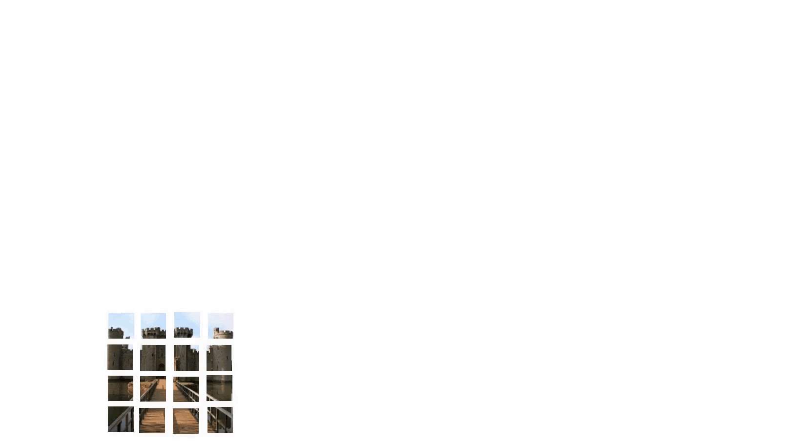

Hiring research interns for neural architecture search projects: houwen.peng@microsoft.com

# AutoML

***This a collection of our AutoML works***

> [**AutoFormer**](https://github.com/microsoft/AutoML/tree/main/AutoFormer) (```NEW```): **AutoFormer: Searching Transformers for Visual Recognition**


> [**Cream**](https://github.com/microsoft/AutoML/tree/main/Cream) (```@NeurIPS'20```): **Cream of the Crop: Distilling Prioritized Paths For One-Shot Neural Architecture Search**


## News
- :boom: July, 2021: [**AutoFormer**](https://github.com/microsoft/AutoML/tree/main/AutoFormer) is now available on arxiv.
- :boom: Oct, 2020: Code for [**Cream**](https://github.com/microsoft/AutoML/tree/main/Cream) is now released.
- :boom: Oct, 2020: [**Cream**](https://github.com/microsoft/AutoML/tree/main/Cream) was accepted to NeurIPS'20

## Works

### AutoFormer

***Coming soon!!!***

AutoFormer is new one-shot architecture search framework dedicated to vision transformer search. It entangles the weights of different vision transformer blocks in the same layers during supernet training. 
Benefiting from the strategy, the trained supernet allows thousands of subnets to be very well-trained. Specifically, the performance of these subnets with weights inherited from the supernet is comparable to those retrained from scratch.
<div align="center">
    
    
</div>


### Cream
**[[Paper]](https://papers.nips.cc/paper/2020/file/d072677d210ac4c03ba046120f0802ec-Paper.pdf) [[Models-Google Drive]](https://drive.google.com/drive/folders/1NLGAbBF9bA1IUAxKlk2VjgRXhr6RHvRW?usp=sharing)[[Models-Baidu Disk (password: wqw6)]](https://pan.baidu.com/s/1TqQNm2s14oEdyNPimw3T9g) [[Slides]]() [[BibTex]](https://scholar.googleusercontent.com/scholar.bib?q=info:ICWVXc_SsKAJ:scholar.google.com/&output=citation&scisdr=CgUmooXfEMfTi0cV5aU:AAGBfm0AAAAAX7sQ_aXoamdKRaBI12tAVN8REq1VKNwM&scisig=AAGBfm0AAAAAX7sQ_RdYtp6BSro3zgbXVJU2MCgsG730&scisf=4&ct=citation&cd=-1&hl=ja)**  <br/>

In this work, we present a simple yet effective architecture distillation method. The central idea is that subnetworks can learn collaboratively and teach each other throughout the training process, aiming to boost the convergence of individual models. We introduce the concept of prioritized path, which refers to the architecture candidates exhibiting superior performance during training. Distilling knowledge from the prioritized paths is able to boost the training of subnetworks. Since the prioritized paths are changed on the fly depending on their performance and complexity, the final obtained paths are the cream of the crop.
<div >
    
</div>


## License
License under an MIT license.

