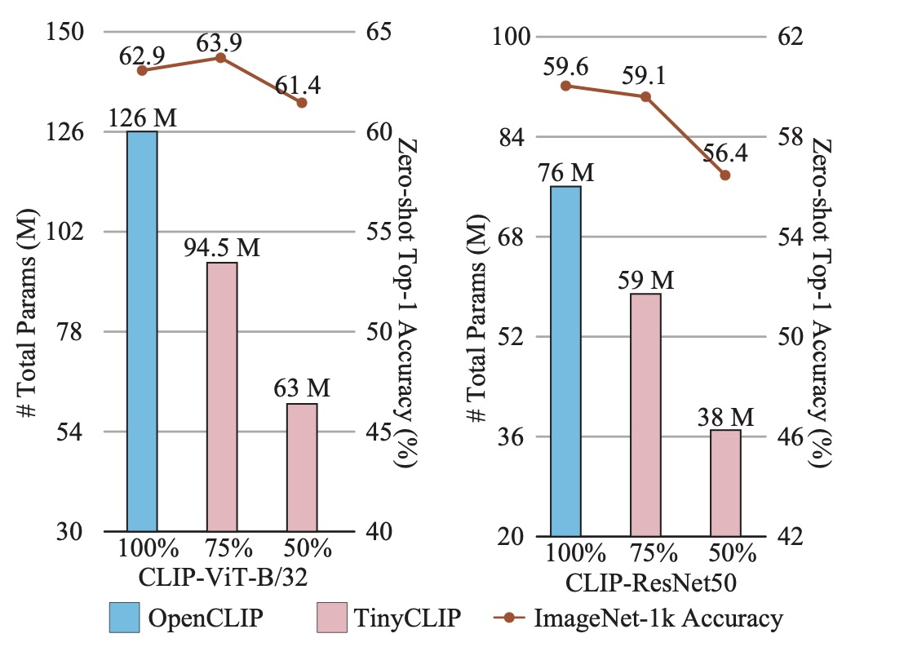

# TinyCLIP: CLIP Distillation via Affinity Mimicking and Weight Inheritance

:pushpin: This is an official PyTorch implementation of **[ICCV 2023]** - [TinyCLIP: CLIP Distillation via Affinity Mimicking and Weight Inheritance](https://openaccess.thecvf.com/content/ICCV2023/html/Wu_TinyCLIP_CLIP_Distillation_via_Affinity_Mimicking_and_Weight_Inheritance_ICCV_2023_paper.html)

**TinyCLIP** is a novel **cross-modal distillation** method for large-scale language-image pre-trained models. The method introduces two core techniques: **affinity mimicking** and **weight inheritance**. This work unleashes the capacity of small CLIP models, fully leveraging large-scale models as well as pre-training data and striking the best trade-off between speed and accuracy.

<p align="center">
  
</p>


## Highlights
<p align="center">
  
</p>

* TinyCLIP ViT-45M/32 uses only **half parameters** of ViT-B/32 to achieves **comparable zero-shot performance**.
* TinyCLIP ResNet-19M reduces the parameters by **50\%** while getting **$2\times$** inference speedup, and obtains **56.4\%** accuracy on ImageNet.

## News
* *Dec.2023* TinyCLIP models have been integrated into [🤗Hugging Face Model Hub](https://huggingface.co/collections/wkcn/tinyclip-model-zoo-6581aa105311fe07be88cb0d).
* *Oct.2023* Training code is released.
* *Sep.2023* This is preliminary released code, including inference code and checkpoints.

## Model Zoo
| Model              | Weight inheritance | Pretrain      | IN-1K Acc@1(%) | MACs(G) | Throughput(pairs/s) | Link |
|--------------------|--------------------|---------------|----------------|---------|---------------------|------|
[TinyCLIP ViT-39M/16 Text-19M](./src/open_clip/model_configs/TinyCLIP-ViT-39M-16-Text-19M.json) | manual | YFCC-15M | 63.5  | 9.5 | 1,469 | [Model](https://github.com/wkcn/TinyCLIP-model-zoo/releases/download/checkpoints/TinyCLIP-ViT-39M-16-Text-19M-YFCC15M.pt)
[TinyCLIP ViT-8M/16 Text-3M](./src/open_clip/model_configs/TinyCLIP-ViT-8M-16-Text-3M.json) | manual | YFCC-15M | 41.1 | 2.0 | 4,150 | [Model](https://github.com/wkcn/TinyCLIP-model-zoo/releases/download/checkpoints/TinyCLIP-ViT-8M-16-Text-3M-YFCC15M.pt)
[TinyCLIP ResNet-30M Text-29M](./src/open_clip/model_configs/TinyCLIP-ResNet-30M-Text-29M.json) | manual | LAION-400M | 59.1  | 6.9 | 1,811 | [Model](https://github.com/wkcn/TinyCLIP-model-zoo/releases/download/checkpoints/TinyCLIP-ResNet-30M-Text-29M-LAION400M.pt)
[TinyCLIP ResNet-19M Text-19M](./src/open_clip/model_configs/TinyCLIP-ResNet-19M-Text-19M.json) | manual | LAION-400M | 56.4  | 4.4 | 3,024| [Model](https://github.com/wkcn/TinyCLIP-model-zoo/releases/download/checkpoints/TinyCLIP-ResNet-19M-Text-19M-LAION400M.pt)
[TinyCLIP ViT-61M/32 Text-29M](./src/open_clip/model_configs/TinyCLIP-ViT-61M-32-Text-29M.json) | manual | LAION-400M | 62.4  | 5.3 | 3,191|[Model](https://github.com/wkcn/TinyCLIP-model-zoo/releases/download/checkpoints/TinyCLIP-ViT-61M-32-Text-29M-LAION400M.pt)
[TinyCLIP ViT-40M/32 Text-19M](./src/open_clip/model_configs/TinyCLIP-ViT-40M-32-Text-19M.json) | manual | LAION-400M | 59.8  | 3.5 | 4,641|[Model](https://github.com/wkcn/TinyCLIP-model-zoo/releases/download/checkpoints/TinyCLIP-ViT-40M-32-Text-19M-LAION400M.pt)
TinyCLIP ViT-63M/32 Text-31M | auto | LAION-400M | 63.9  | 5.6 | 2,905|[Model](https://github.com/wkcn/TinyCLIP-model-zoo/releases/download/checkpoints/TinyCLIP-auto-ViT-63M-32-Text-31M-LAION400M.pt)
TinyCLIP ViT-45M/32 Text-18M | auto | LAION-400M | 61.4  | 3.7 | 3,682|[Model](https://github.com/wkcn/TinyCLIP-model-zoo/releases/download/checkpoints/TinyCLIP-auto-ViT-45M-32-Text-18M-LAION400M.pt)
TinyCLIP ViT-22M/32 Text-10M | auto | LAION-400M | 53.7  | 1.9 | 5,504|[Model](https://github.com/wkcn/TinyCLIP-model-zoo/releases/download/checkpoints/TinyCLIP-auto-ViT-22M-32-Text-10M-LAION400M.pt)
TinyCLIP ViT-63M/32 Text-31M | auto | LAION+YFCC-400M | 64.5 | 5.6| 2,909 | [Model](https://github.com/wkcn/TinyCLIP-model-zoo/releases/download/checkpoints/TinyCLIP-auto-ViT-63M-32-Text-31M-LAIONYFCC400M.pt)
TinyCLIP ViT-45M/32 Text-18M | auto | LAION+YFCC-400M | 62.7  | 1.9 | 3,685 | [Model](https://github.com/wkcn/TinyCLIP-model-zoo/releases/download/checkpoints/TinyCLIP-auto-ViT-45M-32-Text-18M-LAIONYFCC400M.pt)

Note: The configs of models with auto inheritance are generated automatically.

## Getting started
:beginner: Here is the setup tutorial, evaluation and pretraining scripts.

### Install dependencies and prepare dataset
- [Preparation](./docs/PREPARATION.md)

### Evaluate it
- [Evaluation](./docs/EVALUATION.md)

### Model inference
- [Inference](./inference.py)
- [Use with 🤗Hugging Face Transformers](https://huggingface.co/collections/wkcn/tinyclip-model-zoo-6581aa105311fe07be88cb0d)

### Pretrain it
- [Pretraining](./docs/PRETRAINING.md)

## Citation
If this repo is helpful for you, please consider to cite it. :mega: Thank you! :)

```bibtex
@InProceedings{tinyclip,
    title     = {TinyCLIP: CLIP Distillation via Affinity Mimicking and Weight Inheritance},
    author    = {Wu, Kan and Peng, Houwen and Zhou, Zhenghong and Xiao, Bin and Liu, Mengchen and Yuan, Lu and Xuan, Hong and Valenzuela, Michael and Chen, Xi (Stephen) and Wang, Xinggang and Chao, Hongyang and Hu, Han},
    booktitle = {Proceedings of the IEEE/CVF International Conference on Computer Vision (ICCV)},
    month     = {October},
    year      = {2023},
    pages     = {21970-21980}
}
```

## Acknowledge

Our code is based on [CLIP](https://github.com/openai/CLIP), [OpenCLIP](https://github.com/mlfoundations/open_clip), [CoFi](https://github.com/princeton-nlp/CoFiPruning) and [PyTorch](https://github.com/pytorch/pytorch). Thank contributors for their awesome contribution!

## License
- [License](./LICENSE)
