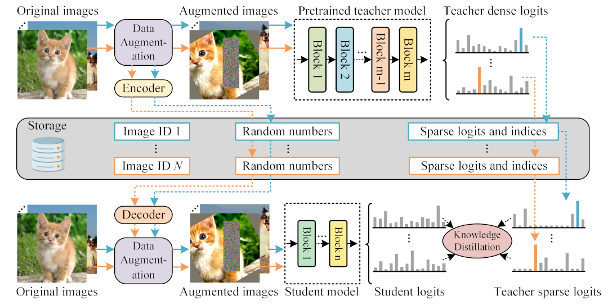
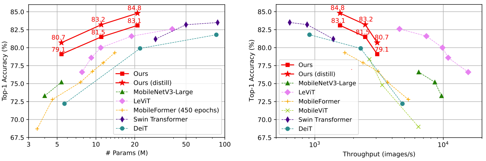

# TinyViT: Fast Pretraining Distillation for Small Vision Transformers [](https://twitter.com/intent/tweet?text=Tiny%20vision%20transformer%20models,%20SOTA%20performance!!&url=https://github.com/microsoft/Cream/tree/main/TinyViT&via=houwen_peng&hashtags=ViT,tiny,efficient)


:pushpin: This is an official PyTorch implementation of **[ECCV 2022]** - [TinyViT: Fast Pretraining Distillation for Small Vision Transformers](https://arxiv.org/pdf/2207.10666.pdf).

TinyViT is a new family of **tiny and efficient** vision transformers pretrained on **large-scale** datasets with our proposed **fast distillation framework**. The central idea is to **transfer knowledge** from **large pretrained models** to small ones. The logits of large teacher models are sparsified and stored in disk in advance to **save the memory cost and computation overheads**.

:rocket: TinyViT with **only 21M parameters** achieves **84.8%** top-1 accuracy on ImageNet-1k, and **86.5%** accuracy under 512x512 resolutions.

<div align="center">
    
</div>

:sunny: Hiring research interns for neural architecture search, tiny transformer design, model compression projects: houwen.peng@microsoft.com.

## Highlights

<div align="center">
    
</div>

* TinyViT-21M  on IN-22k achieves **84.8%** top-1 accuracy on IN-1k, and **86.5%** accuracy under 512x512 resolutions.
* TinyViT-21M **trained from scratch on IN-1k** without distillation achieves **83.1** top-1 accuracy, under **4.3 GFLOPs** and **1,571 images/s** throughput on V100 GPU.
* TinyViT-5M  reaches **80.7%** top-1 accuracy on IN-1k under 3,060 images/s throughput.
* Save teacher logits **once**, and **reuse** the saved sparse logits to distill **arbitrary students without overhead** of teacher model. It takes **16 GB / 481 GB** storage space for IN-1k (300 epochs) and IN-22k (90 epochs), respectively.

## Features
1. **Efficient Distillation**. The teacher logits can be saved in parallel and reused for arbitrary student models, to avoid re-forwarding cost of the large teacher model.

2. **Reproducibility**. We provide the hyper-parameters of [IN-1k training](./configs/1k), [IN-22k pre-training with distillation](./configs/22k_distill), [IN-22kto1k fine-tuning](./configs/22kto1k), and [higher resolution fine-tuning](./configs/higher_resolution). In addition, all training logs are public (in Model Zoo).

3. **Ease of Use**. One file to build a TinyViT model.
The file [`models/tiny_vit.py`](./models/tiny_vit.py) defines TinyViT model family.
    ```python
    from tiny_vit import tiny_vit_21m_224
    model = tiny_vit_21m_224(pretrained=True)
    output = model(image)
    ```

4. **Extensibility**. Add custom dataset, student and teacher models with no need to modify your code.
The class [`DatasetWrapper`](./data/build.py#L74) wraps the general dataset to support saving and loading sparse logits. It only need the logits of models for knowledge distillation.

5. **Public teacher model**. We provide CLIP-ViT-Large/16-22k, a powerful teacher model on pretraining distillation (Acc@1 85.894 Acc@5 97.566 on IN-1k). We finetuned CLIP-ViT-Large/16 released by OpenAI on IN-22k.

6. **Online Logging**. Support [wandb](https://wandb.ai) for checking the results anytime anywhere.

## Model Zoo

Model                                      | Pretrain | Input | Acc@1 | Acc@5 | #Params | MACs | FPS  | 22k Model | 1k Model
:-----------------------------------------:|:---------|:-----:|:-----:|:-----:|:-------:|:----:|:----:|:---------:|:--------:
TinyViT-5M        | IN-22k   |224x224| 80.7  | 95.6  | 5.4M    | 1.3G | 3,060|[link](https://github.com/wkcn/TinyViT-model-zoo/releases/download/checkpoints/tiny_vit_5m_22k_distill.pth)/[config](./configs/22k_distill/tiny_vit_5m_22k_distill.yaml)/[log](https://github.com/wkcn/TinyViT-model-zoo/releases/download/checkpoints/tiny_vit_5m_22k_distill.log)|[link](https://github.com/wkcn/TinyViT-model-zoo/releases/download/checkpoints/tiny_vit_5m_22kto1k_distill.pth)/[config](./configs/22kto1k/tiny_vit_5m_22kto1k.yaml)/[log](https://github.com/wkcn/TinyViT-model-zoo/releases/download/checkpoints/tiny_vit_5m_22kto1k_distill.log)
TinyViT-11M       | IN-22k   |224x224| 83.2  | 96.5  | 11M     | 2.0G | 2,468|[link](https://github.com/wkcn/TinyViT-model-zoo/releases/download/checkpoints/tiny_vit_11m_22k_distill.pth)/[config](./configs/22k_distill/tiny_vit_11m_22k_distill.yaml)/[log](https://github.com/wkcn/TinyViT-model-zoo/releases/download/checkpoints/tiny_vit_11m_22k_distill.log)|[link](https://github.com/wkcn/TinyViT-model-zoo/releases/download/checkpoints/tiny_vit_11m_22kto1k_distill.pth)/[config](./configs/22kto1k/tiny_vit_11m_22kto1k.yaml)/[log](https://github.com/wkcn/TinyViT-model-zoo/releases/download/checkpoints/tiny_vit_11m_22kto1k_distill.log)
TinyViT-21M       | IN-22k   |224x224| 84.8  | 97.3  | 21M     | 4.3G | 1,571|[link](https://github.com/wkcn/TinyViT-model-zoo/releases/download/checkpoints/tiny_vit_21m_22k_distill.pth)/[config](./configs/22k_distill/tiny_vit_21m_22k_distill.yaml)/[log](https://github.com/wkcn/TinyViT-model-zoo/releases/download/checkpoints/tiny_vit_21m_22k_distill.log)|[link](https://github.com/wkcn/TinyViT-model-zoo/releases/download/checkpoints/tiny_vit_21m_22kto1k_distill.pth)/[config](./configs/22kto1k/tiny_vit_21m_22kto1k.yaml)/[log](https://github.com/wkcn/TinyViT-model-zoo/releases/download/checkpoints/tiny_vit_21m_22kto1k_distill.log)
TinyViT-21M-384   | IN-22k   |384x384| 86.2  | 97.8  | 21M     | 13.8G| 394  | - |[link](https://github.com/wkcn/TinyViT-model-zoo/releases/download/checkpoints/tiny_vit_21m_22kto1k_384_distill.pth)/[config](./configs/higher_resolution/tiny_vit_21m_224to384.yaml)/[log](https://github.com/wkcn/TinyViT-model-zoo/releases/download/checkpoints/tiny_vit_21m_22kto1k_384_distill.log)
TinyViT-21M-512   | IN-22k   |512x512| 86.5  | 97.9  | 21M     | 27.0G| 167  | - |[link](https://github.com/wkcn/TinyViT-model-zoo/releases/download/checkpoints/tiny_vit_21m_22kto1k_512_distill.pth)/[config](./configs/higher_resolution/tiny_vit_21m_384to512.yaml)/[log](https://github.com/wkcn/TinyViT-model-zoo/releases/download/checkpoints/tiny_vit_21m_22kto1k_512_distill.log)
TinyViT-5M                                 | IN-1k    |224x224| 79.1  | 94.8  | 5.4M    | 1.3G | 3,060| - |[link](https://github.com/wkcn/TinyViT-model-zoo/releases/download/checkpoints/tiny_vit_5m_1k.pth)/[config](./configs/1k/tiny_vit_5m.yaml)/[log](https://github.com/wkcn/TinyViT-model-zoo/releases/download/checkpoints/tiny_vit_5m_1k.log)
TinyViT-11M                                | IN-1k    |224x224| 81.5  | 95.8  | 11M     | 2.0G | 2,468| - |[link](https://github.com/wkcn/TinyViT-model-zoo/releases/download/checkpoints/tiny_vit_11m_1k.pth)/[config](./configs/1k/tiny_vit_11m.yaml)/[log](https://github.com/wkcn/TinyViT-model-zoo/releases/download/checkpoints/tiny_vit_11m_1k.log)
TinyViT-21M                                | IN-1k    |224x224| 83.1  | 96.5  | 21M     | 4.3G | 1,571| - |[link](https://github.com/wkcn/TinyViT-model-zoo/releases/download/checkpoints/tiny_vit_21m_1k.pth)/[config](./configs/1k/tiny_vit_21m.yaml)/[log](https://github.com/wkcn/TinyViT-model-zoo/releases/download/checkpoints/tiny_vit_21m_1k.log)

ImageNet-22k (IN-22k) is the same as ImageNet-21k (IN-21k), where the number of classes is 21,841.

The models with  are pretrained on ImageNet-22k with the distillation of CLIP-ViT-L/14-22k, then finetuned on ImageNet-1k.

We finetune the 1k models on IN-1k to higher resolution progressively (224 -> 384 -> 512) [[detail]](./docs/TRAINING.md), without any IN-1k knowledge distillation.

## Getting Started
:beginner: Here is the setup tutorial and evaluation scripts.

### Install dependencies and prepare datasets
- [Preparation](./docs/PREPARATION.md)

### Evaluate it !
- [Evaluation](./docs/EVALUATION.md)

## Pretrain a TinyViT model on ImageNet
:beginner: For the proposed fast pretraining distillation, we need to **save teacher sparse logits** firstly, then **pretrain a model**.

- [How to save teacher sparse logits?](./docs/SAVE_TEACHER_LOGITS.md)
- [Let's train a TinyViT model](./docs/TRAINING.md)

## Citation

If this repo is helpful for you, please consider to cite it. :mega: Thank you! :)

```bibtex
@InProceedings{tiny_vit,
  title={TinyViT: Fast Pretraining Distillation for Small Vision Transformers},
  author={Wu, Kan and Zhang, Jinnian and Peng, Houwen and Liu, Mengchen and Xiao, Bin and Fu, Jianlong and Yuan, Lu},
  booktitle={European conference on computer vision (ECCV)},
  year={2022}
}
```

## Acknowledge

Our code is based on [Swin Transformer](https://github.com/microsoft/swin-transformer), [LeViT](https://github.com/facebookresearch/LeViT), [pytorch-image-models](https://github.com/rwightman/pytorch-image-models), [CLIP](https://github.com/openai/CLIP) and [PyTorch](https://github.com/pytorch/pytorch). Thank contributors for their awesome contribution!


## License

- [License](./LICENSE)
